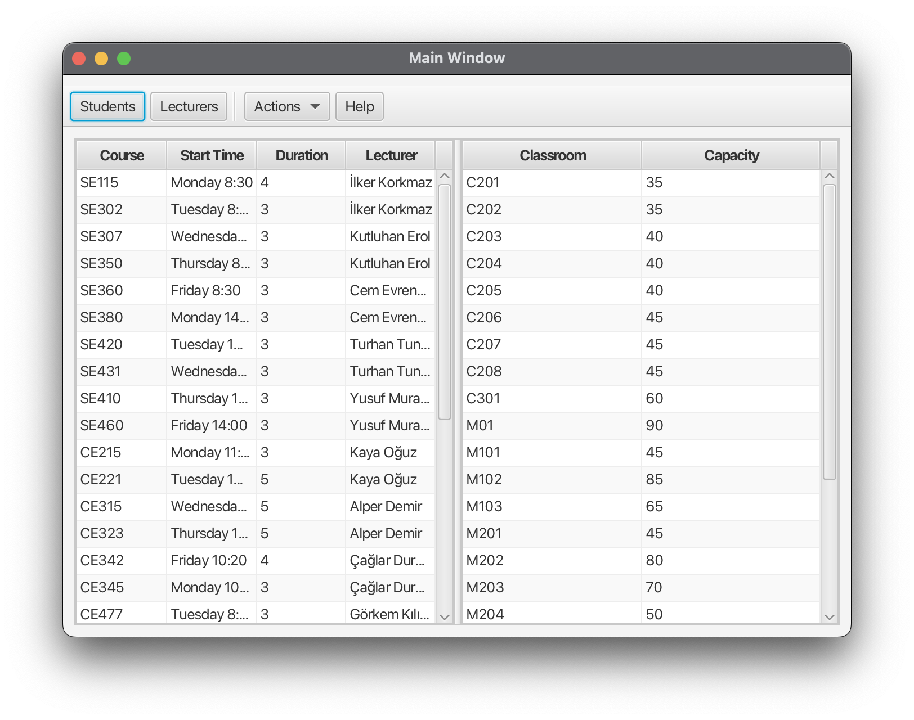
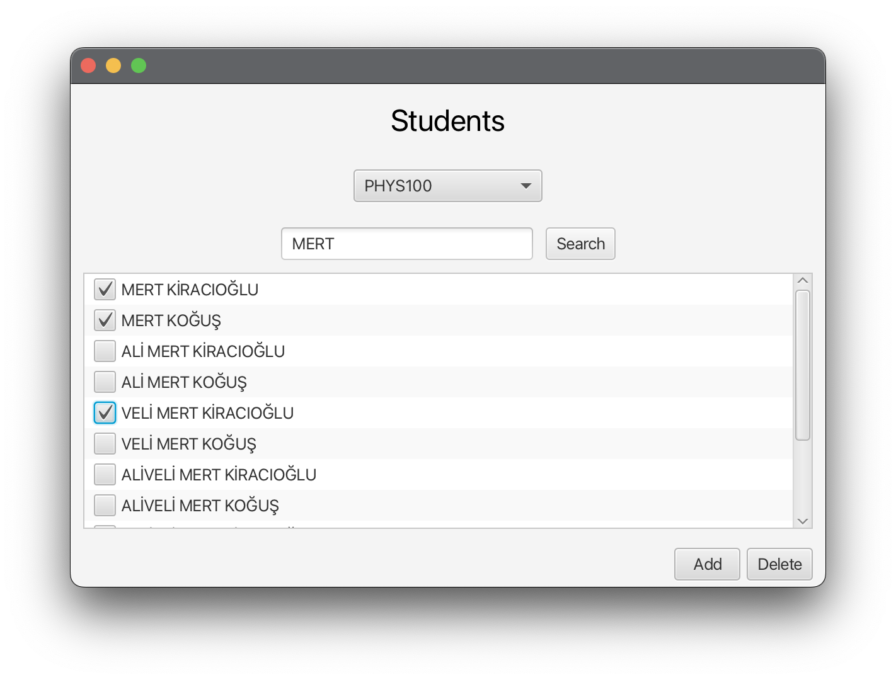
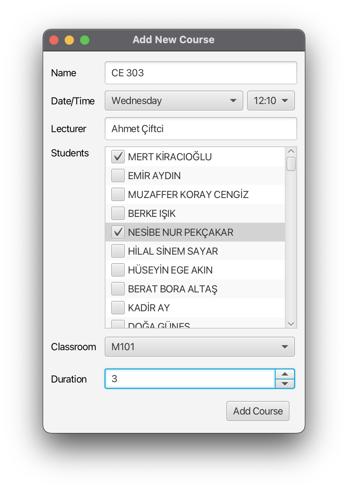
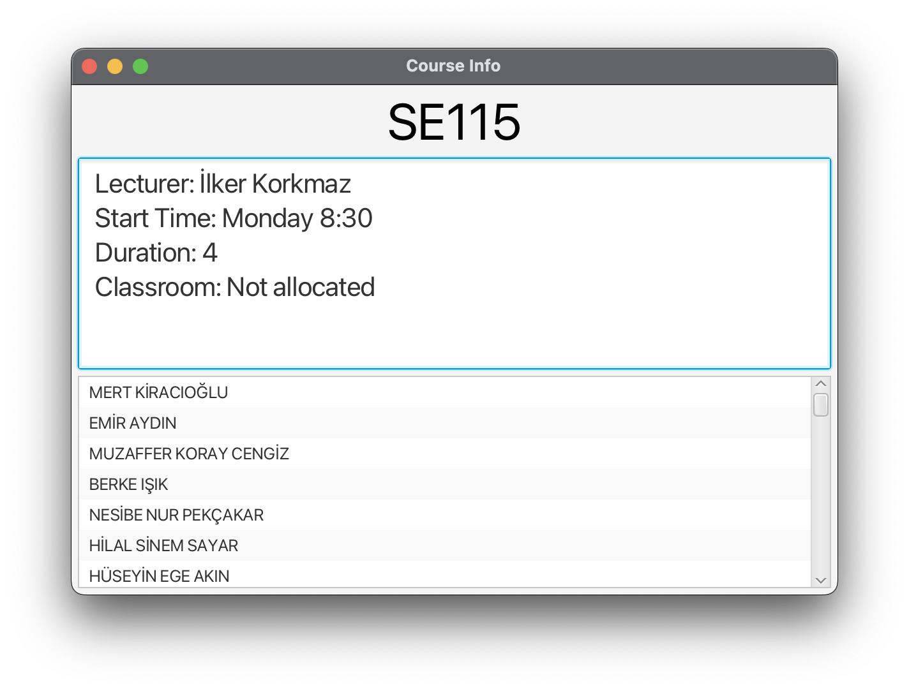
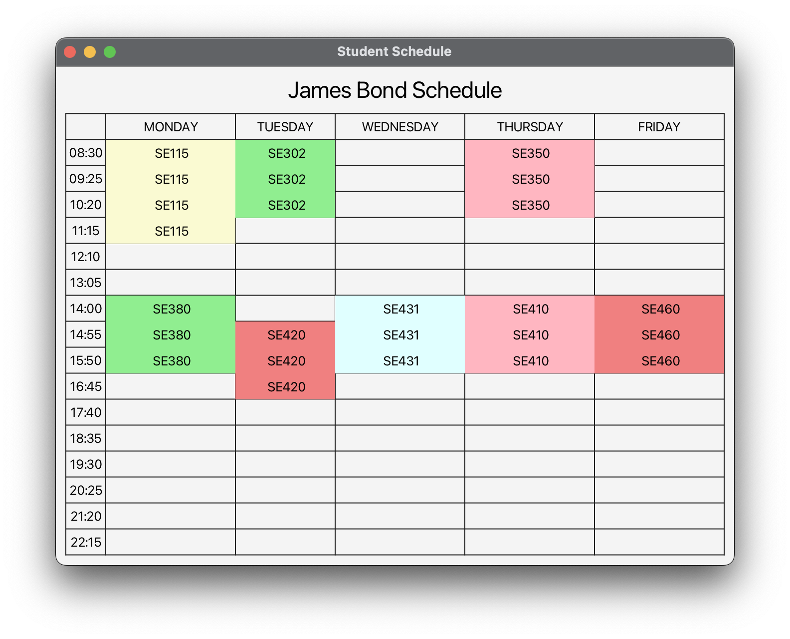

# Overview
Course Scheduler is a desktop application that simplifies the process of scheduling classrooms for courses. It offers features for managing new courses, assigning classrooms, and creating weekly plans for students, lecturers, and classrooms. The application is built using Java, with JavaFX for the graphical user interface and SQLite for database management.

# Features
- **Automatic and Manual Classroom Assignment:** Assign classrooms based on capacity or manually override assignments.
- **Course Management:** Create new courses, and assign or withdraw students.
- **CSV Import:** Import classroom and course data from CSV files.
- **Data Viewing:** View schedules and details for students, lecturers, classrooms, and courses.

# Installation
##  Prerequisites
- Operating system: Windows
- Ensure you have Java Runtime Environment (JRE) installed (version 8 or higher).
[Download JRE here](https://www.oracle.com/java/technologies/downloads/#java8).

## Windows Installation Guide
1. Download the [latest release](https://github.com/MahmutOzgurKizil/se302-course-scheduler/releases) of the Course Scheduler
2. Open setup.exe in the project folder
3. Follow the installation guide:
    * Choose an install folder
    * Decide on creating shortcuts
4. Launch the app from the Start Menu or Desktop Shortcut

# Usage
### Main Functions
- Assign Classroom: Automatically or manually assign classrooms to courses.
- Manage Students: Add or remove students from courses.
- Add New Course: Input course details such as name, start time, duration, and lecturer.
- Import CSV Data: Import course and classroom details from a CSV file.
  
### User Interface
The application provides an intuitive GUI with:
- Menu Bar: For accessing core features like assigning classrooms, adding courses, and importing data.

- Dialog Panels: Simplified actions for adding/deleting students, creating courses, and importing data.

  
  

- Data Tables: View and manage lists of courses, students, lecturers, and classrooms.

  
  

### File Structure
- Database: The system stores data in an SQLite database file located in the user's Documents folder.
- CSV Support: The application supports importing classroom and course data from CSV files.
  * [Sample courses file](images_data/sample_courses.csv)
  * [Sample classrooms file](images_data/sample_classrooms.csv)

### Help
Access the inbuilt Help menu for detailed instructions on using the application. No internet connection is required to view the manual.

## Reporting Issues
If you find a bug or want to suggest a new feature, please open an issue on the GitHub repository.

## Project Management
We use Trello to manage tasks and track the progress of this project.
You can view our Trello board [here](https://trello.com/b/RFIcKUbP/se-302-project).

